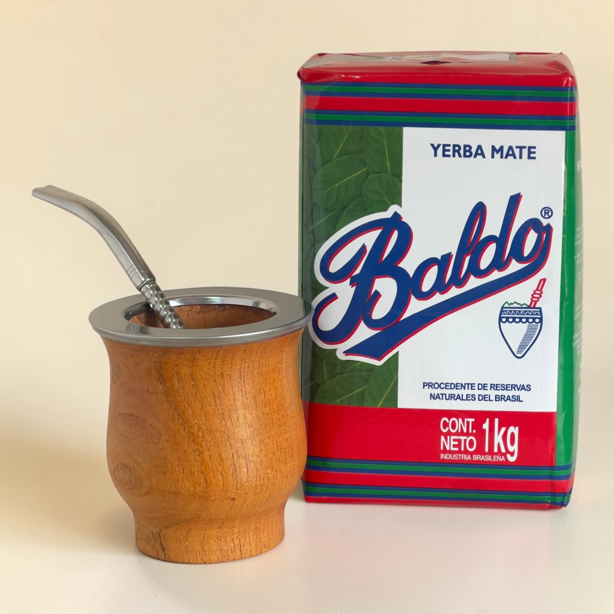
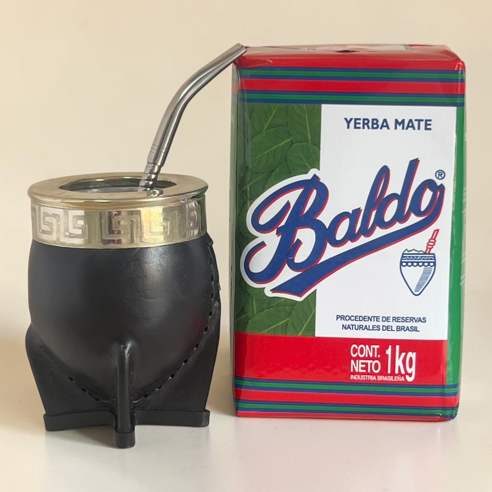
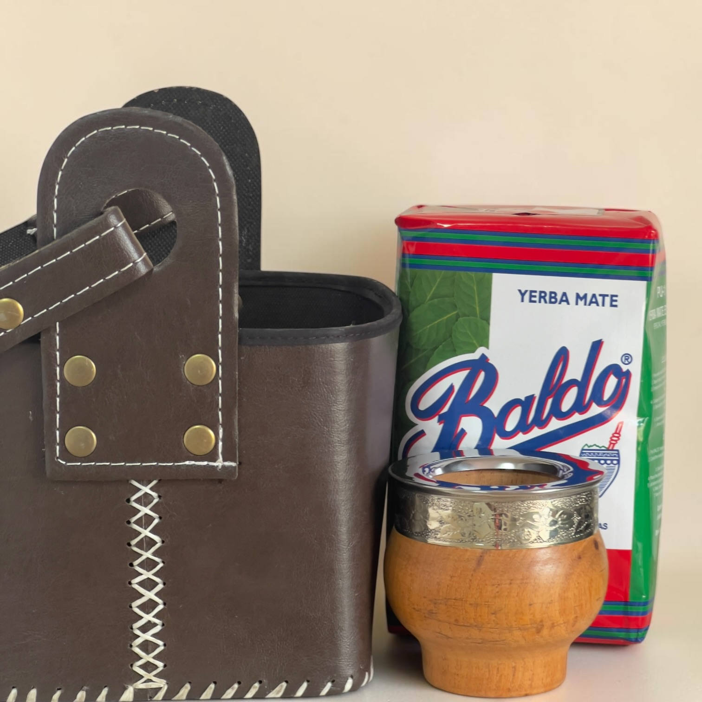
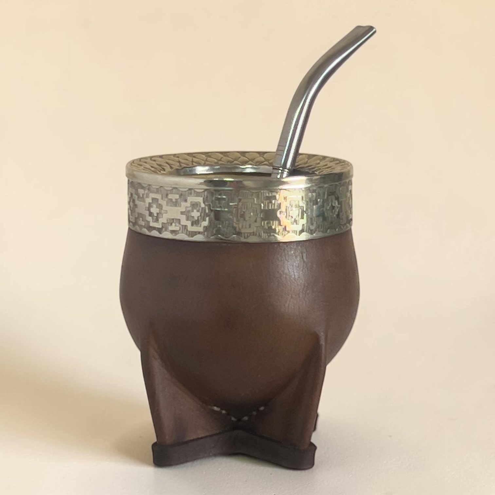

```{=html}
<style>
  .catalog-gallery-stage {
    position: relative;
    overflow: hidden;
    background: #eee5d8;
  }

  .catalog-gallery-main {
    display: block;
    width: 100%;
    aspect-ratio: 1 / 1;
    object-fit: cover;
  }

  .catalog-gallery-button {
    position: absolute;
    top: 50%;
    z-index: 2;
    display: grid;
    place-items: center;
    width: 38px;
    height: 38px;
    padding: 0;
    color: #f6efe3;
    background: rgba(24, 49, 40, 0.88);
    border: 1px solid rgba(196, 154, 74, 0.55);
    border-radius: 50%;
    cursor: pointer;
    transform: translateY(-50%);
  }

  .catalog-gallery-button:hover {
    background: #c49a4a;
    color: #1b3028;
  }

  .catalog-gallery-prev { left: 0.7rem; }
  .catalog-gallery-next { right: 0.7rem; }

  .catalog-gallery-count {
    position: absolute;
    right: 0.7rem;
    bottom: 0.7rem;
    padding: 0.25rem 0.55rem;
    color: #f6efe3;
    background: rgba(24, 49, 40, 0.88);
    border-radius: 999px;
    font-size: 0.68rem;
    font-weight: 700;
  }

  .catalog-gallery-thumbs {
    display: flex;
    gap: 0.45rem;
    padding: 0.6rem;
    overflow-x: auto;
    background: #f7efe3;
  }

  .catalog-gallery-thumb {
    flex: 0 0 58px;
    width: 58px;
    height: 58px;
    padding: 0;
    overflow: hidden;
    background: transparent;
    border: 2px solid transparent;
    border-radius: 0.4rem;
    cursor: pointer;
  }

  .catalog-gallery-thumb.is-active {
    border-color: #c49a4a;
  }

  .catalog-gallery-thumb img {
    width: 100%;
    height: 100%;
    object-fit: cover;
  }

  .catalog-stock-note {
    margin: 0.8rem 0 0;
    font-size: 0.8rem;
    color: rgba(34, 48, 42, 0.7);
  }
</style>

<section class="catalog-hero">
  <div class="catalog-hero-inner">
    <p class="hero-eyebrow">CATÁLOGO 2026</p>
    <h1>Encuentra tu compañero de camino</h1>
    <p>
      Mates, bombillas, materas, kits y yerba seleccionados
      para acompañar cada ritual.
    </p>

    <div class="catalog-hero-actions">
      <a
        href="documentos/catalogo-rumbo-corcel-2026.pdf"
        class="button button-primary"
        target="_blank"
        rel="noopener noreferrer">
        Ver catálogo PDF
      </a>

      <a
        href="https://wa.me/message/5PEO6Z2GUZLNP1"
        class="button button-secondary"
        target="_blank"
        rel="noopener noreferrer">
        Consultar por WhatsApp
      </a>
    </div>

    <p class="catalog-stock-note">
      Los precios y la disponibilidad se actualizan en vivo desde nuestro inventario.
    </p>
  </div>
</section>

<section class="catalog-section">
  <div class="section-container">
    <div class="catalog-filters" aria-label="Filtrar catálogo">
      <button class="catalog-filter is-active" data-filter="all">Todos</button>
      <button class="catalog-filter" data-filter="mates">Mates</button>
      <button class="catalog-filter" data-filter="bombillas">Bombillas</button>
      <button class="catalog-filter" data-filter="materas">Materas</button>
      <button class="catalog-filter" data-filter="kits">Kits</button>
      <button class="catalog-filter" data-filter="yerba">Yerba</button>
    </div>

    <div class="catalog-grid">

      <!-- MATES -->

      <article class="catalog-card" data-category="mates" data-product-sku="MATE-001">
        <div class="catalog-media catalog-gallery" data-gallery>
          <div class="catalog-gallery-stage">
            
            <button class="catalog-gallery-button catalog-gallery-prev" type="button" data-gallery-prev aria-label="Imagen anterior">‹</button>
            <button class="catalog-gallery-button catalog-gallery-next" type="button" data-gallery-next aria-label="Imagen siguiente">›</button>
            <span class="catalog-gallery-count" data-gallery-count>1 / 4</span>
          </div>
          <div class="catalog-gallery-thumbs" aria-label="Imágenes de Camionero Algarrobo">
            <button class="catalog-gallery-thumb is-active" type="button" data-gallery-image="images/productos/nuevas/MATE-001 (1).jpg"></button>
            <button class="catalog-gallery-thumb" type="button" data-gallery-image="images/productos/nuevas/MATE-001 (2).jpg"></button>
            <button class="catalog-gallery-thumb" type="button" data-gallery-image="images/productos/nuevas/MATE-001 (3).jpg"></button>
            <button class="catalog-gallery-thumb" type="button" data-gallery-image="images/productos/nuevas/MATE-001 (4).jpg"></button>
          </div>
        </div>
        <div class="catalog-body">
          <span class="product-category">Mate</span>
          <h2>Camionero Algarrobo</h2>
          <div class="catalog-tags"><span>Necesita curado</span><span>Algarrobo</span><span>Virola de acero</span><span>Boca ancha</span></div>
          <p>Algarrobo macizo, resistente y cómodo para el uso diario. Necesita curado.</p>
          <p class="stock-status is-loading" data-stock-status aria-live="polite">Consultando stock…</p>
          <strong class="catalog-price">$19.990</strong>
          <a href="https://wa.me/message/5PEO6Z2GUZLNP1" class="product-cta" target="_blank" rel="noopener noreferrer">Consultar</a>
        </div>
      </article>

      <article class="catalog-card" data-category="mates" data-product-sku="MATE-002">
        <div class="catalog-media catalog-gallery" data-gallery>
          <div class="catalog-gallery-stage">
            
            <button class="catalog-gallery-button catalog-gallery-prev" type="button" data-gallery-prev aria-label="Imagen anterior">‹</button>
            <button class="catalog-gallery-button catalog-gallery-next" type="button" data-gallery-next aria-label="Imagen siguiente">›</button>
            <span class="catalog-gallery-count" data-gallery-count>1 / 3</span>
          </div>
          <div class="catalog-gallery-thumbs" aria-label="Imágenes de Imperial Algarrobo Virola Alpaca">
            <button class="catalog-gallery-thumb is-active" type="button" data-gallery-image="images/productos/nuevas/MATE-002 (1).jpg"></button>
            <button class="catalog-gallery-thumb" type="button" data-gallery-image="images/productos/nuevas/MATE-002 (2).jpg"></button>
            <button class="catalog-gallery-thumb" type="button" data-gallery-image="images/productos/nuevas/MATE-002 (3).jpg"></button>
          </div>
        </div>
        <div class="catalog-body">
          <span class="product-category">Mate</span>
          <h2>Imperial Algarrobo Virola Alpaca</h2>
          <div class="catalog-tags"><span>Necesita curado</span><span>Algarrobo</span><span>Virola de alpaca</span><span>Hecho a mano</span></div>
          <p>Algarrobo firme, con virola de alpaca cincelada y buen peso en mano. Necesita curado.</p>
          <p class="stock-status is-loading" data-stock-status aria-live="polite">Consultando stock…</p>
          <strong class="catalog-price">$32.990</strong>
          <a href="https://wa.me/message/5PEO6Z2GUZLNP1" class="product-cta" target="_blank" rel="noopener noreferrer">Consultar</a>
        </div>
      </article>

      <article class="catalog-card" data-category="mates" data-product-sku="MATE-003">
        <div class="catalog-media catalog-gallery" data-gallery>
          <div class="catalog-gallery-stage">
            
            <button class="catalog-gallery-button catalog-gallery-prev" type="button" data-gallery-prev aria-label="Imagen anterior">‹</button>
            <button class="catalog-gallery-button catalog-gallery-next" type="button" data-gallery-next aria-label="Imagen siguiente">›</button>
            <span class="catalog-gallery-count" data-gallery-count>1 / 5</span>
          </div>
          <div class="catalog-gallery-thumbs" aria-label="Imágenes de Imperial Virola Deluxe Alpaca">
            <button class="catalog-gallery-thumb is-active" type="button" data-gallery-image="images/productos/nuevas/MATE-003 (1).jpg"></button>
            <button class="catalog-gallery-thumb" type="button" data-gallery-image="images/productos/nuevas/MATE-003 (2).jpg"></button>
            <button class="catalog-gallery-thumb" type="button" data-gallery-image="images/productos/nuevas/MATE-003 (3).png"></button>
            <button class="catalog-gallery-thumb" type="button" data-gallery-image="images/productos/nuevas/MATE-003 (4).jpg"></button>
            <button class="catalog-gallery-thumb" type="button" data-gallery-image="images/productos/nuevas/MATE-003 (6).jpg"></button>
          </div>
        </div>
        <div class="catalog-body">
          <span class="product-category">Mate</span>
          <h2>Imperial Virola Deluxe Alpaca</h2>
          <div class="catalog-tags"><span>Virola de alpaca</span><span>Interior a elección</span><span>Hecho a mano</span></div>
          <p>Interior de calabaza o acero inoxidable, según disponibilidad.</p>
          <p class="stock-status is-loading" data-stock-status aria-live="polite">Consultando stock…</p>
          <strong class="catalog-price">$34.990</strong>
          <a href="https://wa.me/message/5PEO6Z2GUZLNP1" class="product-cta" target="_blank" rel="noopener noreferrer">Consultar</a>
        </div>
      </article>


      <article class="catalog-card" data-category="mates" data-product-sku="MATE-005">
        <div class="catalog-media catalog-gallery" data-gallery>
          <div class="catalog-gallery-stage">
            
            <button class="catalog-gallery-button catalog-gallery-prev" type="button" data-gallery-prev aria-label="Imagen anterior">‹</button>
            <button class="catalog-gallery-button catalog-gallery-next" type="button" data-gallery-next aria-label="Imagen siguiente">›</button>
            <span class="catalog-gallery-count" data-gallery-count>1 / 4</span>
          </div>
          <div class="catalog-gallery-thumbs" aria-label="Imágenes de Imperial Uruguayo Alpaca Cincelada">
            <button class="catalog-gallery-thumb is-active" type="button" data-gallery-image="images/productos/nuevas/MATE-005 (0).jpg"></button>
            <button class="catalog-gallery-thumb" type="button" data-gallery-image="images/productos/nuevas/MATE-005 (1).jpg"></button>
            <button class="catalog-gallery-thumb" type="button" data-gallery-image="images/productos/nuevas/MATE-005 (2).jpg"></button>
            <button class="catalog-gallery-thumb" type="button" data-gallery-image="images/productos/nuevas/MATE-005 (3).jpg"></button>
            <button class="catalog-gallery-thumb" type="button" data-gallery-image="images/productos/nuevas/MATE-005 (4).jpg"></button>
            <button class="catalog-gallery-thumb" type="button" data-gallery-image="images/productos/nuevas/MATE-005 (5).jpg"></button>
          </div>
        </div>
        <div class="catalog-body">
          <span class="product-category">Mate</span>
          <h2>Imperial Uruguayo Alpaca Cincelada</h2>
          <div class="catalog-tags"><span>Necesita curado</span><span>Cuero coñac</span><span>Interior de calabaza</span><span>Pieza única</span></div>
          <p>Calabaza forrada en cuero coñac con virola de alpaca cincelada a mano.</p>
          <p class="stock-status is-loading" data-stock-status aria-live="polite">Consultando stock…</p>
          <strong class="catalog-price">$39.990</strong>
          <a href="https://wa.me/message/5PEO6Z2GUZLNP1" class="product-cta" target="_blank" rel="noopener noreferrer">Consultar</a>
        </div>
      </article>

      <!-- BOMBILLAS -->

      <article class="catalog-card" data-category="bombillas" data-product-sku="BOMB-001">
        <div class="catalog-media catalog-gallery" data-gallery>
          <div class="catalog-gallery-stage">
            
            <button class="catalog-gallery-button catalog-gallery-prev" type="button" data-gallery-prev aria-label="Imagen anterior">‹</button>
            <button class="catalog-gallery-button catalog-gallery-next" type="button" data-gallery-next aria-label="Imagen siguiente">›</button>
            <span class="catalog-gallery-count" data-gallery-count>1 / 4</span>
          </div>
          <div class="catalog-gallery-thumbs" aria-label="Imágenes de Bombillas Acero Surtidas">
            <button class="catalog-gallery-thumb is-active" type="button" data-gallery-image="images/productos/nuevas/BOMB-001 (1).png"></button>
            <button class="catalog-gallery-thumb" type="button" data-gallery-image="images/productos/nuevas/BOMB-001 (2).png"></button>
            <button class="catalog-gallery-thumb" type="button" data-gallery-image="images/productos/nuevas/BOMB-001 (3).jpg"></button>
            <button class="catalog-gallery-thumb" type="button" data-gallery-image="images/productos/nuevas/BOMB-001 (4).jpg"></button>
          </div>
        </div>
        <div class="catalog-body">
          <span class="product-category">Bombillas</span>
          <h2>Bombillas Acero Surtidas</h2>
          <div class="catalog-tags"><span>Acero inoxidable</span><span>16 cm</span><span>Modelos surtidos</span></div>
          <p>Modelos de acero inoxidable para renovar la tuya o empezar bien desde el primer sorbo.</p>
          <p class="stock-status is-loading" data-stock-status aria-live="polite">Consultando stock…</p>
          <strong class="catalog-price">$9.990</strong>
          <a href="https://wa.me/message/5PEO6Z2GUZLNP1" class="product-cta" target="_blank" rel="noopener noreferrer">Consultar</a>
        </div>
      </article>

      <!-- MATERAS -->

      <article class="catalog-card" data-category="materas" data-product-sku="MTER-001-NEG">
        <div class="catalog-media catalog-gallery" data-gallery>
          <div class="catalog-gallery-stage">
            
            <button class="catalog-gallery-button catalog-gallery-prev" type="button" data-gallery-prev aria-label="Imagen anterior">‹</button>
            <button class="catalog-gallery-button catalog-gallery-next" type="button" data-gallery-next aria-label="Imagen siguiente">›</button>
            <span class="catalog-gallery-count" data-gallery-count>1 / 3</span>
          </div>
          <div class="catalog-gallery-thumbs" aria-label="Imágenes de Matera de Cuero Negra">
            <button class="catalog-gallery-thumb is-active" type="button" data-gallery-image="images/productos/nuevas/MTER-001-NEG (1).jpg"></button>
            <button class="catalog-gallery-thumb" type="button" data-gallery-image="images/productos/nuevas/MTER-001-NEG (2).jpg"></button>
            <button class="catalog-gallery-thumb" type="button" data-gallery-image="images/productos/nuevas/MTER-001-NEG (3).jpg"></button>
          </div>
        </div>
        <div class="catalog-body">
          <span class="product-category">Matera</span>
          <h2>Matera de Cuero Negra</h2>
          <div class="catalog-tags"><span>Cuero genuino</span><span>Color negro</span><span>4 compartimientos</span></div>
          <p>Espacio para termo de hasta 1 litro, mate, yerba y accesorios.</p>
          <p class="stock-status is-loading" data-stock-status aria-live="polite">Consultando stock…</p>
          <strong class="catalog-price">$34.990</strong>
          <a href="https://wa.me/message/5PEO6Z2GUZLNP1" class="product-cta" target="_blank" rel="noopener noreferrer">Consultar</a>
        </div>
      </article>

      <article class="catalog-card" data-category="materas" data-product-sku="MTER-002-VIN">
        <div class="catalog-media catalog-gallery" data-gallery>
          <div class="catalog-gallery-stage">
            
            <button class="catalog-gallery-button catalog-gallery-prev" type="button" data-gallery-prev aria-label="Imagen anterior">‹</button>
            <button class="catalog-gallery-button catalog-gallery-next" type="button" data-gallery-next aria-label="Imagen siguiente">›</button>
            <span class="catalog-gallery-count" data-gallery-count>1 / 2</span>
          </div>
          <div class="catalog-gallery-thumbs" aria-label="Imágenes de Matera de Cuero Vino">
            <button class="catalog-gallery-thumb is-active" type="button" data-gallery-image="images/productos/nuevas/MTER-002-VIN (1).jpg"></button>
            <button class="catalog-gallery-thumb" type="button" data-gallery-image="images/productos/nuevas/MTER-002-VIN (2).jpg"></button>
          </div>
        </div>
        <div class="catalog-body">
          <span class="product-category">Matera</span>
          <h2>Matera de Cuero Vino</h2>
          <div class="catalog-tags"><span>Cuero genuino</span><span>Color vino</span><span>4 compartimientos</span></div>
          <p>Matera de cuero color vino para llevar termo, mate, yerba y accesorios.</p>
          <p class="stock-status is-loading" data-stock-status aria-live="polite">Consultando stock…</p>
          <strong class="catalog-price">$34.990</strong>
          <a href="https://wa.me/message/5PEO6Z2GUZLNP1" class="product-cta" target="_blank" rel="noopener noreferrer">Consultar</a>
        </div>
      </article>

      <article class="catalog-card" data-category="materas" data-product-sku="MTER-003-SIML">
        <div class="catalog-media catalog-gallery" data-gallery>
          <div class="catalog-gallery-stage">
            
            <button class="catalog-gallery-button catalog-gallery-prev" type="button" data-gallery-prev aria-label="Imagen anterior">‹</button>
            <button class="catalog-gallery-button catalog-gallery-next" type="button" data-gallery-next aria-label="Imagen siguiente">›</button>
            <span class="catalog-gallery-count" data-gallery-count>1 / 2</span>
          </div>
          <div class="catalog-gallery-thumbs" aria-label="Imágenes de Matera Símil Cuero">
            <button class="catalog-gallery-thumb is-active" type="button" data-gallery-image="images/productos/nuevas/MTER-003-SIML (1).jpg"></button>
            <button class="catalog-gallery-thumb" type="button" data-gallery-image="images/productos/nuevas/MTER-003-SIML (2).jpg"></button>
          </div>
        </div>
        <div class="catalog-body">
          <span class="product-category">Matera</span>
          <h2>Matera Símil Cuero</h2>
          <div class="catalog-tags"><span>Símil cuero</span><span>Liviana</span><span>4 compartimientos</span></div>
          <p>Liviana y práctica, con espacio para termo, mate, bombilla y accesorios.</p>
          <p class="stock-status is-loading" data-stock-status aria-live="polite">Consultando stock…</p>
          <strong class="catalog-price">$19.990</strong>
          <a href="https://wa.me/message/5PEO6Z2GUZLNP1" class="product-cta" target="_blank" rel="noopener noreferrer">Consultar</a>
        </div>
      </article>

      <!-- KITS -->

      <article class="catalog-card" data-category="kits" data-product-sku="KIT-001">
        <div class="catalog-media"></div>
        <div class="catalog-body">
          <span class="product-category">Kit</span>
          <h2>El Primer Rumbo — con yerba</h2>
          <div class="catalog-tags"><span>Camionero</span><span>Bombilla</span><span>Yerba Baldo</span></div>
          <p>Camionero Algarrobo, bombilla de acero y yerba Baldo de 1 kg.</p>
          <p class="stock-status is-loading" data-stock-status aria-live="polite">Consultando stock…</p>
          <strong class="catalog-price">$37.990</strong>
          <a href="https://wa.me/message/5PEO6Z2GUZLNP1" class="product-cta" target="_blank" rel="noopener noreferrer">Consultar</a>
        </div>
      </article>

      <article class="catalog-card" data-category="kits" data-product-sku="KIT-002">
        <div class="catalog-media"></div>
        <div class="catalog-body">
          <span class="product-category">Kit</span>
          <h2>El Virola — con yerba</h2>
          <div class="catalog-tags"><span>Imperial Virola</span><span>Bombilla</span><span>Yerba Baldo</span></div>
          <p>Imperial Virola Deluxe, bombilla de acero y yerba Baldo de 1 kg.</p>
          <p class="stock-status is-loading" data-stock-status aria-live="polite">Consultando stock…</p>
          <strong class="catalog-price">$51.990</strong>
          <a href="https://wa.me/message/5PEO6Z2GUZLNP1" class="product-cta" target="_blank" rel="noopener noreferrer">Consultar</a>
        </div>
      </article>

      <article class="catalog-card" data-category="kits" data-product-sku="KIT-004">
        <div class="catalog-media"></div>
        <div class="catalog-body">
          <span class="product-category">Kit</span>
          <h2>Matera Lista — con yerba</h2>
          <div class="catalog-tags"><span>Camionero</span><span>Matera</span><span>Bombilla y yerba</span></div>
          <p>Camionero, matera símil cuero, bombilla de acero y yerba Baldo.</p>
          <p class="stock-status is-loading" data-stock-status aria-live="polite">Consultando stock…</p>
          <strong class="catalog-price">$55.990</strong>
          <a href="https://wa.me/message/5PEO6Z2GUZLNP1" class="product-cta" target="_blank" rel="noopener noreferrer">Consultar</a>
        </div>
      </article>

      <article class="catalog-card" data-category="kits" data-product-sku="KIT-008">
        <div class="catalog-media"></div>
        <div class="catalog-body">
          <div class="featured-labels"><span class="product-category">Kit</span><span class="product-badge">Sin yerba</span></div>
          <h2>El Virola — sin yerba</h2>
          <div class="catalog-tags"><span>Imperial Virola</span><span>Bombilla de acero</span></div>
          <p>Imperial Virola Deluxe y bombilla de acero, sin incluir yerba.</p>
          <p class="stock-status is-loading" data-stock-status aria-live="polite">Consultando stock…</p>
          <strong class="catalog-price">$40.990</strong>
          <a href="https://wa.me/message/5PEO6Z2GUZLNP1" class="product-cta" target="_blank" rel="noopener noreferrer">Consultar</a>
        </div>
      </article>

      <!-- YERBA -->

      <article class="catalog-card" data-category="yerba" data-product-sku="YERB-001">
        <div class="catalog-media"></div>
        <div class="catalog-body">
          <span class="product-category">Yerba</span>
          <h2>Yerba Baldo 1 kg</h2>
          <div class="catalog-tags"><span>1 kg</span><span>Sabor equilibrado</span><span>Rendidora</span></div>
          <p>Molienda pareja, sabor equilibrado y buen rendimiento en cada cebada.</p>
          <p class="stock-status is-loading" data-stock-status aria-live="polite">Consultando stock…</p>
          <strong class="catalog-price">$11.990</strong>
          <a href="https://wa.me/message/5PEO6Z2GUZLNP1" class="product-cta" target="_blank" rel="noopener noreferrer">Consultar</a>
        </div>
      </article>

    </div>
  </div>
</section>

<script>
  document.addEventListener("DOMContentLoaded", () => {
    document.querySelectorAll("[data-gallery]").forEach((gallery) => {
      const mainImage = gallery.querySelector(".catalog-gallery-main");
      const thumbnails = Array.from(
        gallery.querySelectorAll("[data-gallery-image]")
      );
      const count = gallery.querySelector("[data-gallery-count]");
      const previous = gallery.querySelector("[data-gallery-prev]");
      const next = gallery.querySelector("[data-gallery-next]");

      if (!mainImage || thumbnails.length === 0) return;

      let currentIndex = 0;

      const showImage = (index) => {
        currentIndex = (index + thumbnails.length) % thumbnails.length;
        const selected = thumbnails[currentIndex];
        const selectedImage = selected.querySelector("img");

        mainImage.src = selected.dataset.galleryImage;
        mainImage.alt = selectedImage?.alt || mainImage.alt;

        thumbnails.forEach((thumbnail, thumbnailIndex) => {
          thumbnail.classList.toggle(
            "is-active",
            thumbnailIndex === currentIndex
          );
        });

        if (count) {
          count.textContent = `${currentIndex + 1} / ${thumbnails.length}`;
        }
      };

      thumbnails.forEach((thumbnail, index) => {
        thumbnail.addEventListener("click", () => showImage(index));
      });

      previous?.addEventListener("click", () => showImage(currentIndex - 1));
      next?.addEventListener("click", () => showImage(currentIndex + 1));
    });
  });
</script>
```
