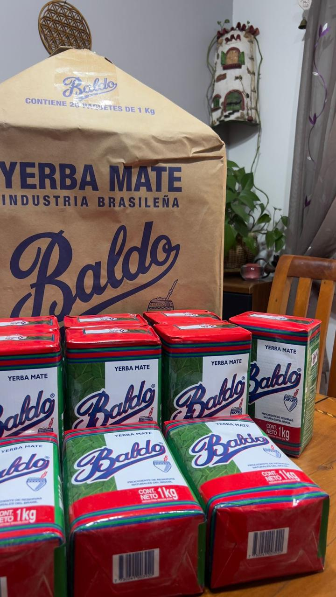

```{=html}
<section class="hero-section home-carousel" id="inicio" data-home-carousel aria-roledescription="carrusel" aria-label="Portada y novedades de Rumbo Corcel">

  <div class="home-carousel-viewport">
    <div class="home-carousel-track" data-home-carousel-track>

      <article class="home-slide home-slide-cover" data-home-slide aria-label="1 de 4">

        <div class="hero-background" aria-hidden="true"></div>
        <div class="hero-overlay" aria-hidden="true"></div>

        <div class="hero-inner">
          <div class="hero-content">

            <p class="hero-eyebrow">EN CADA CAMINO</p>

            <h1>
              Tradición matera<br>
              con alma del sur
            </h1>

            <p class="hero-description">
              Mates, bombillas, yerba, kits y materas para acompañar cada ritual.
            </p>

            <div class="hero-buttons">

              <a href="#productos"
                 class="button button-primary">
                Ver los más elegidos
              </a>

              <a href="https://wa.me/message/5PEO6Z2GUZLNP1"
                 class="button button-secondary"
                 target="_blank"
                 rel="noopener noreferrer">
                Hablar por WhatsApp
              </a>

            </div>

            <div class="hero-shipping">
              <span class="shipping-icon">✦</span>

              <div>
                <strong>Envíos a todo Chile</strong>
                <small>Retiro en Quilicura o envío por Blue Express</small>
              </div>
            </div>

          </div>
        </div>

        <a href="#productos"
           class="hero-scroll"
           aria-label="Bajar a productos destacados">
          <span>Descubrir</span>
          <strong>↓</strong>
        </a>

      </article>

      <article class="home-slide home-slide-novedad" data-home-slide aria-label="2 de 4">
        <div class="home-novedad-inner">

          <div class="home-novedad-copy">
            <p class="home-novedad-kicker">MITOS DEL MATE</p>
            <h2>¿El mate da cáncer?</h2>
            <p>
              La respuesta no está en la yerba, sino en cómo entendemos la temperatura.
              Revisa esta guía visual y conoce el contexto detrás del mito.
            </p>
            <div class="home-novedad-actions">
              <a href="novedad-mate-cancer.html"
                 class="button button-primary"
                 data-novedad-open
                 data-home-slide-index="1">
                Abrir publicación
              </a>
              <a href="novedades.html" class="home-novedad-secondary">
                Ver todas las novedades
              </a>
            </div>
          </div>

          <a href="novedad-mate-cancer.html"
             class="home-novedad-cover"
             data-novedad-open
             data-home-slide-index="1"
             aria-label="Abrir publicación sobre el mate y el cáncer">
            
            <span>Leer publicación completa →</span>
          </a>

        </div>
      </article>

      <article class="home-slide home-slide-novedad" data-home-slide aria-label="3 de 4">
        <div class="home-novedad-inner">

          <div class="home-novedad-copy">
            <p class="home-novedad-kicker">GUÍA MATERA</p>
            <h2>¿Calabaza o acero inoxidable?</h2>
            <p>
              Tradición, sabor, practicidad y limpieza. Compara ambos materiales y
              descubre cuál se adapta mejor a tu forma de tomar mate.
            </p>
            <div class="home-novedad-actions">
              <a href="novedad-calabaza-acero.html"
                 class="button button-primary"
                 data-novedad-open
                 data-home-slide-index="2">
                Ver comparación
              </a>
              <a href="novedades.html" class="home-novedad-secondary">
                Ver todas las novedades
              </a>
            </div>
          </div>

          <a href="novedad-calabaza-acero.html"
             class="home-novedad-cover"
             data-novedad-open
             data-home-slide-index="2"
             aria-label="Abrir comparación entre mate de calabaza y acero inoxidable">
            
            <span>Leer publicación completa →</span>
          </a>

        </div>
      </article>

      <article class="home-slide home-slide-novedad" data-home-slide aria-label="4 de 4">
        <div class="home-novedad-inner">

          <div class="home-novedad-copy">
            <p class="home-novedad-kicker">RITUAL MATERO</p>
            <h2>¿Sigues tomando mate por costumbre?</h2>
            <p>
              Hay rituales que permanecen porque se sienten bien. Descubre algunas
              razones para seguir haciendo una pausa con tu mate.
            </p>
            <div class="home-novedad-actions">
              <a href="novedad-mate-costumbre.html"
                 class="button button-primary"
                 data-novedad-open
                 data-home-slide-index="3">
                Descubrir razones
              </a>
              <a href="novedades.html" class="home-novedad-secondary">
                Ver todas las novedades
              </a>
            </div>
          </div>

          <a href="novedad-mate-costumbre.html"
             class="home-novedad-cover"
             data-novedad-open
             data-home-slide-index="3"
             aria-label="Abrir publicación sobre tomar mate por costumbre">
            
            <span>Leer publicación completa →</span>
          </a>

        </div>
      </article>

    </div>
  </div>

  <button class="home-carousel-arrow home-carousel-prev"
          type="button"
          aria-label="Ver elemento anterior">
    ‹
  </button>

  <button class="home-carousel-arrow home-carousel-next"
          type="button"
          aria-label="Ver elemento siguiente">
    ›
  </button>

  <div class="home-carousel-dots" role="tablist" aria-label="Seleccionar contenido">
    <button type="button" data-home-dot="0" aria-label="Ver portada" aria-selected="true"></button>
    <button type="button" data-home-dot="1" aria-label="Ver El mate da cáncer" aria-selected="false"></button>
    <button type="button" data-home-dot="2" aria-label="Ver Calabaza o acero" aria-selected="false"></button>
    <button type="button" data-home-dot="3" aria-label="Ver Mate por costumbre" aria-selected="false"></button>
  </div>

  <div class="home-carousel-counter" aria-live="polite">
    <span data-home-current>01</span>
    <span aria-hidden="true">/</span>
    <span>04</span>
  </div>

</section>

<section id="productos" class="leather-section featured-section">

  <div class="section-container">

    <p class="section-eyebrow">LO MÁS ELEGIDO</p>

    <h2>Favoritos de Rumbo Corcel</h2>

    <p class="section-introduction">
      Selección basada en las ventas con producto identificado en nuestro registro histórico.
      El precio y el stock se actualizan en vivo desde nuestro inventario.
    </p>

    <div class="product-carousel" data-carousel>

      <button
        class="carousel-arrow carousel-arrow-left"
        type="button"
        aria-label="Ver productos anteriores">
        ‹
      </button>

      <div class="product-track">

        <!-- 1. Producto con más ventas identificadas -->
        <article class="featured-card" data-product-sku="YERB-001">

          <div class="featured-media">
            
            <div class="image-placeholder">
              <strong>Rumbo Corcel</strong>
              <small>Foto próximamente</small>
            </div>
          </div>

          <div class="featured-body">

            <div class="featured-labels">
              <span class="product-category">Yerba</span>
              <span class="product-badge">Más vendida</span>
            </div>

            <h3>Yerba Baldo 1 kg</h3>

            <p>
              Molienda pareja, sabor equilibrado y buen rendimiento para el mate diario.
            </p>

            <p
              class="stock-status is-loading"
              data-stock-status
              aria-live="polite">
              Consultando stock…
            </p>

            <strong class="featured-price">$11.990</strong>

            <a
              href="https://wa.me/message/5PEO6Z2GUZLNP1"
              class="product-cta"
              target="_blank"
              rel="noopener noreferrer">
              Consultar
            </a>

          </div>

        </article>

        <!-- 2. Kit vendido y registrado -->
        <article class="featured-card" data-product-sku="KIT-001">

          <div class="featured-media">
            
            <div class="image-placeholder">
              <strong>Rumbo Corcel</strong>
              <small>Foto próximamente</small>
            </div>
          </div>

          <div class="featured-body">

            <div class="featured-labels">
              <span class="product-category">Kit</span>
              <span class="product-badge">Ideal para comenzar</span>
            </div>

            <h3>El Primer Rumbo</h3>

            <p>
              Camionero Algarrobo, bombilla de acero y yerba Baldo de 1 kg.
            </p>

            <p
              class="stock-status is-loading"
              data-stock-status
              aria-live="polite">
              Consultando stock…
            </p>

            <strong class="featured-price">$37.990</strong>

            <a
              href="https://wa.me/message/5PEO6Z2GUZLNP1"
              class="product-cta"
              target="_blank"
              rel="noopener noreferrer">
              Consultar
            </a>

          </div>

        </article>

        <!-- 3. Kit vendido y registrado -->
        <article class="featured-card" data-product-sku="KIT-002">

          <div class="featured-media">
            
            <div class="image-placeholder">
              <strong>Rumbo Corcel</strong>
              <small>Foto próximamente</small>
            </div>
          </div>

          <div class="featured-body">

            <div class="featured-labels">
              <span class="product-category">Kit</span>
              <span class="product-badge">Favorito</span>
            </div>

            <h3>El Virola</h3>

            <p>
              Imperial Uruguayo Cincelada, bombilla de acero y yerba Baldo.
            </p>

            <p
              class="stock-status is-loading"
              data-stock-status
              aria-live="polite">
              Consultando stock…
            </p>

            <strong class="featured-price">$51.990</strong>

            <a
              href="https://wa.me/message/5PEO6Z2GUZLNP1"
              class="product-cta"
              target="_blank"
              rel="noopener noreferrer">
              Consultar
            </a>

          </div>

        </article>

        <!-- 4. Venta individual registrada y componente de kits -->
        <article class="featured-card" data-product-sku="BOMB-001">

          <div class="featured-media">
            
            <div class="image-placeholder">
              <strong>Rumbo Corcel</strong>
              <small>Foto próximamente</small>
            </div>
          </div>

          <div class="featured-body">

            <div class="featured-labels">
              <span class="product-category">Bombillas</span>
            </div>

            <h3>Bombillas de acero</h3>

            <p>
              Acero inoxidable y modelos surtidos para acompañar distintos estilos de mate.
            </p>

            <p
              class="stock-status is-loading"
              data-stock-status
              aria-live="polite">
              Consultando stock…
            </p>

            <strong class="featured-price">$9.990</strong>

            <a
              href="https://wa.me/message/5PEO6Z2GUZLNP1"
              class="product-cta"
              target="_blank"
              rel="noopener noreferrer">
              Consultar
            </a>

          </div>

        </article>

        <!-- 5. Mate con venta identificada -->
        <article class="featured-card" data-product-sku="MATE-005">

          <div class="featured-media">
            
            <div class="image-placeholder">
              <strong>Rumbo Corcel</strong>
              <small>Foto próximamente</small>
            </div>
          </div>

          <div class="featured-body">

            <div class="featured-labels">
              <span class="product-category">Mate</span>
              <span class="product-badge">Pieza única</span>
            </div>

            <h3>Imperial Uruguayo Cincelada</h3>

            <p>
              Calabaza forrada en cuero, con virola de alpaca cincelada a mano.
            </p>

            <p
              class="stock-status is-loading"
              data-stock-status
              aria-live="polite">
              Consultando stock…
            </p>

            <strong class="featured-price">$39.990</strong>

            <a
              href="https://wa.me/message/5PEO6Z2GUZLNP1"
              class="product-cta"
              target="_blank"
              rel="noopener noreferrer">
              Consultar
            </a>

          </div>

        </article>

      </div>

      <button
        class="carousel-arrow carousel-arrow-right"
        type="button"
        aria-label="Ver productos siguientes">
        ›
      </button>

    </div>

    <div class="featured-footer">

      <a href="catalogo.html" class="button button-primary">
        Ver catálogo completo
      </a>

      <a
        href="documentos/catalogo-rumbo-corcel-2026.pdf"
        class="button button-secondary"
        target="_blank"
        rel="noopener noreferrer">
        Ver catálogo en PDF
      </a>

    </div>

  </div>

</section>
```
