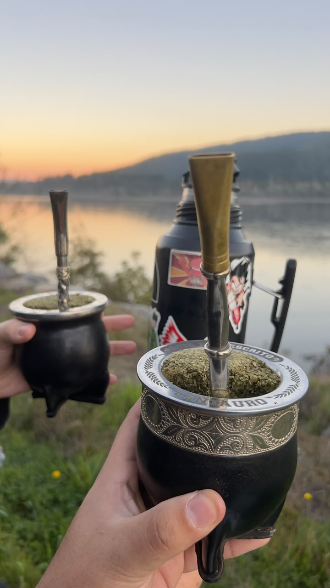
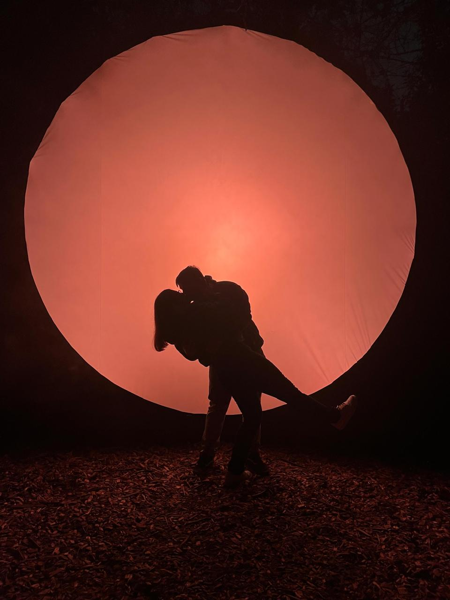

::::::::::: nosotros-contenedor
::: nosotros-introduccion
[NUESTRA HISTORIA]{.nosotros-etiqueta}

# Detrás de Rumbo Corcel

Un proyecto nacido de una pasión compartida, construido con dedicación y acompañado siempre por un buen mate.
:::

::::: nosotros-bloque
::: nosotros-imagen
{.nosotros-foto}
:::

::: nosotros-texto
[UNA PASIÓN QUE NOS ACOMPAÑA]{.nosotros-etiqueta}

## El mate siempre ha formado parte de nuestra historia

Somos una pareja chilena que, entre el trabajo, los estudios y la vida cotidiana, encontró en el mate una pausa para compartir.

El mate nos ha acompañado en viajes, conversaciones, tardes de estudio, días intensos y momentos simples. Con el tiempo entendimos que no era solamente una bebida, sino una costumbre que nos permitía detenernos, acompañarnos y disfrutar un poco más cada momento.

De esa pasión nació **Rumbo Corcel**: un proyecto creado con dedicación y mucho cariño, con el propósito de acercar el mundo del mate a más personas y hogares.
:::
:::::

::::: {.nosotros-bloque .nosotros-bloque-invertido}
::: nosotros-texto
[UN PROYECTO HECHO PARA CRECER]{.nosotros-etiqueta}

## Una idea sencilla que se convirtió en algo nuestro

Comenzamos esta página para mantener nuestro catálogo actualizado, ordenar nuestras ventas y permitir que cada persona pudiera conocer nuestros productos de manera fácil y directa. Sin embargo, poco a poco se ha convertido en algo mucho más significativo para nosotros.

Rumbo Corcel representa el deseo de construir algo propio, aprender juntos y compartir una costumbre que ha formado parte de nuestra historia. Seleccionamos cada producto pensando en quienes disfrutan del mate a diario y también en quienes recién están comenzando a descubrirlo.

Soñamos con que este proyecto crezca, perdure en el tiempo y algún día pueda convertirse en un espacio físico donde podamos recibir a otras personas que compartan esta misma pasión.
:::

::: nosotros-imagen
{.nosotros-foto loading="lazy"}
:::
:::::

::: nosotros-cierre
Quizás algún día volvamos a esta página, o la lean nuestros hijos, y podamos recordar que todo comenzó en nuestra juventud, mientras trabajábamos, estudiábamos y soñábamos con construir algo propio, siempre con un mate entre las manos. 
C & L

[Conoce nuestro catálogo](catalogo.html){.boton-nosotros}
:::
:::::::::::
