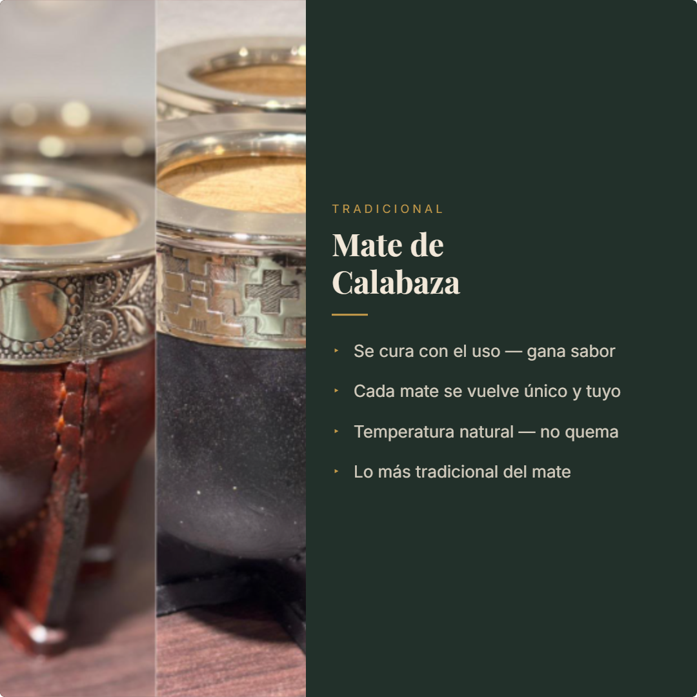
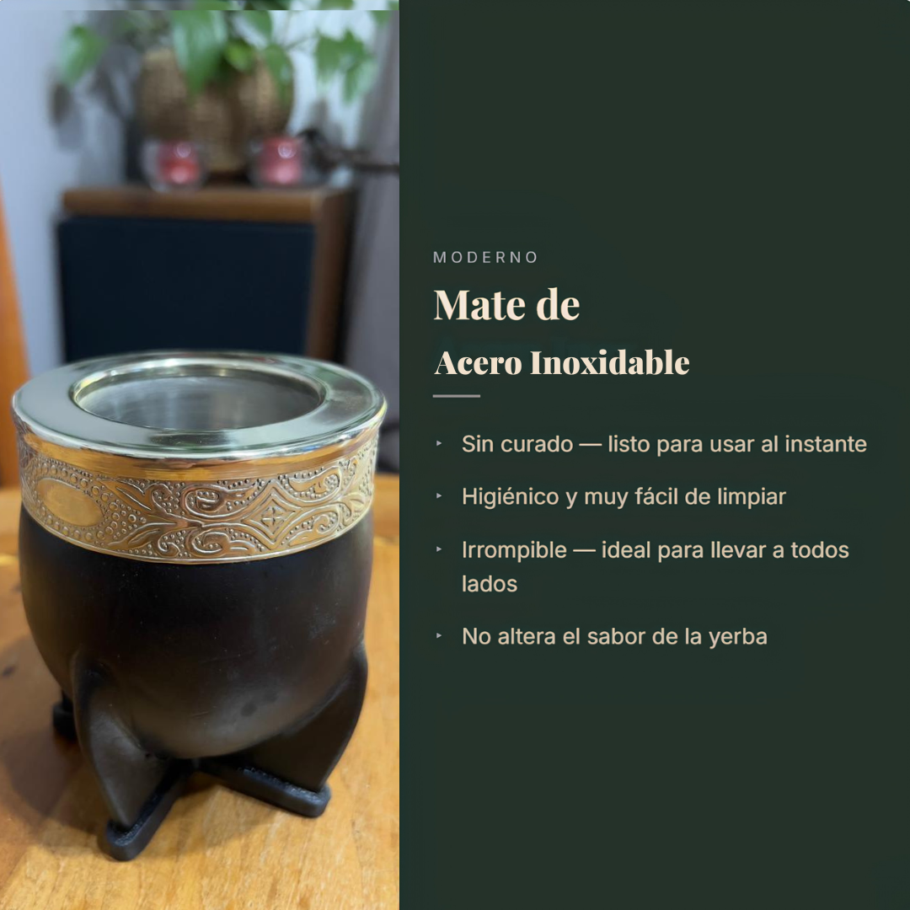
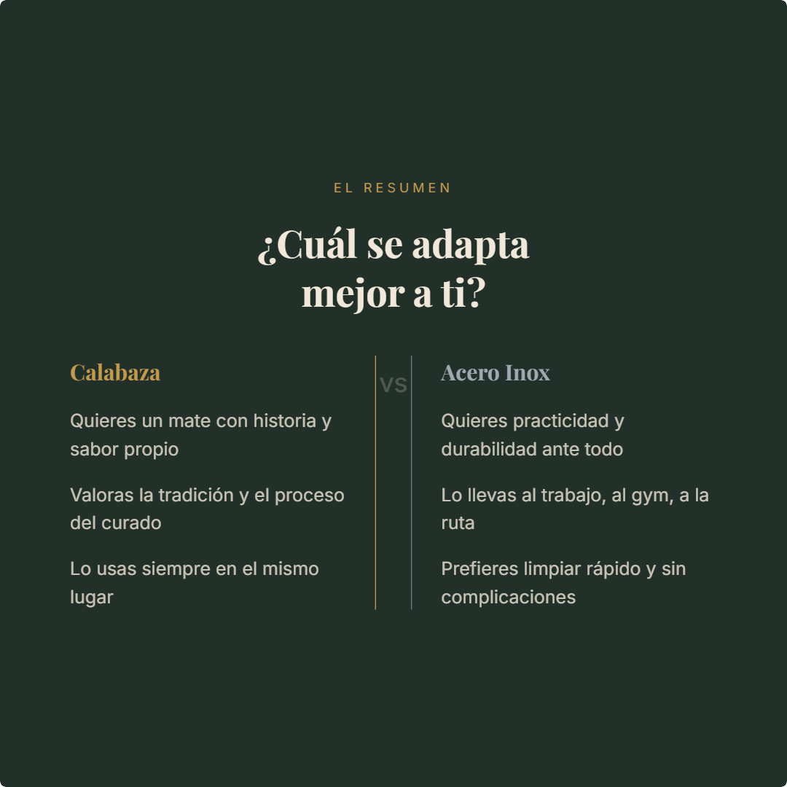
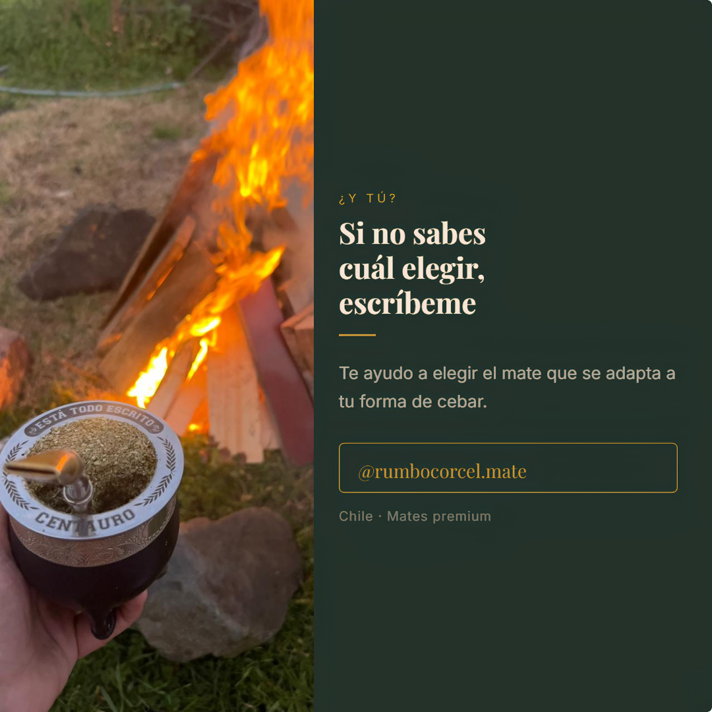

```{=html}
<main class="story-page">

  <header class="story-header">
    <a class="story-back" href="index.html?slide=2#inicio">← Volver al carrusel</a>
    <p class="section-eyebrow">GUÍA MATERA · ELECCIÓN</p>
    <h1>Calabaza o acero inoxidable</h1>
    <p>Compara las características de ambos materiales y descubre cuál encaja mejor con tu rutina y tu forma de cebar.</p>
  </header>

  <section class="story-gallery" data-story-gallery tabindex="0" aria-label="Galería de la publicación Calabaza o acero inoxidable">

    <button class="story-gallery-arrow story-gallery-prev" type="button" aria-label="Ver imagen anterior">‹</button>

    <div class="story-gallery-viewport">
      <div class="story-gallery-track" data-story-track>
        <figure class="story-gallery-slide" data-story-slide aria-label="Imagen 1 de 5">
          
        </figure>
        <figure class="story-gallery-slide" data-story-slide aria-label="Imagen 2 de 5">
          
        </figure>
        <figure class="story-gallery-slide" data-story-slide aria-label="Imagen 3 de 5">
          
        </figure>
        <figure class="story-gallery-slide" data-story-slide aria-label="Imagen 4 de 5">
          
        </figure>
        <figure class="story-gallery-slide" data-story-slide aria-label="Imagen 5 de 5">
          
        </figure>
      </div>
    </div>

    <button class="story-gallery-arrow story-gallery-next" type="button" aria-label="Ver imagen siguiente">›</button>

    <div class="story-gallery-footer">
      <div class="story-gallery-dots" role="tablist" aria-label="Elegir imagen">
        <button type="button" data-story-dot="0" aria-label="Ver imagen 1" aria-selected="true"></button>
        <button type="button" data-story-dot="1" aria-label="Ver imagen 2" aria-selected="false"></button>
        <button type="button" data-story-dot="2" aria-label="Ver imagen 3" aria-selected="false"></button>
        <button type="button" data-story-dot="3" aria-label="Ver imagen 4" aria-selected="false"></button>
        <button type="button" data-story-dot="4" aria-label="Ver imagen 5" aria-selected="false"></button>
      </div>
      <div class="story-gallery-count" aria-live="polite">
        <span data-story-current>01</span> / 05
      </div>
    </div>

  </section>

  <div class="story-actions">
    <a href="novedades.html" class="button button-secondary">Ver más novedades</a>
    <a href="https://www.instagram.com/p/DZvG9L2FpCa/" class="button button-primary" target="_blank" rel="noopener noreferrer">Ver en Instagram</a>
  </div>

</main>
```
